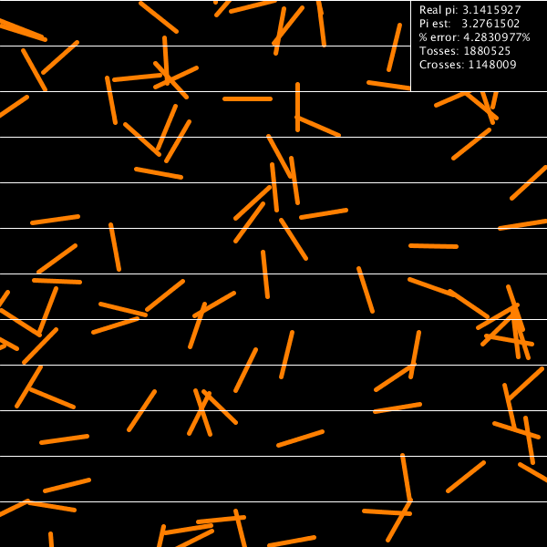

# Pi Estimation 2019
This uses [Buffon's needle problem](https://en.wikipedia.org/wiki/Buffon%27s_needle_problem) to calculate pi.

The top-right side of the window shows the actual value of pi (as used by Java), the estimated value of pi, the percent error, the number of needles tossed, and the number of needles that crossed a line.

